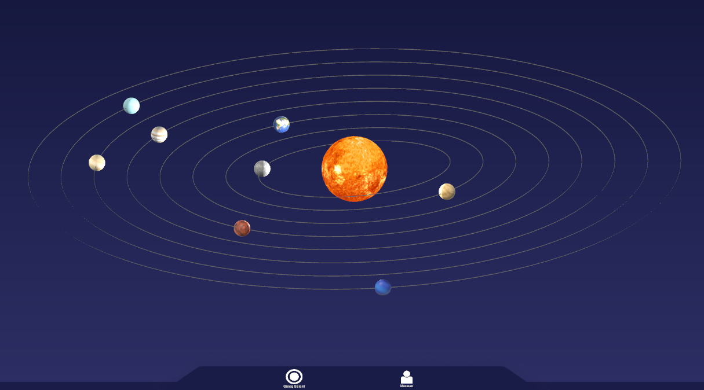
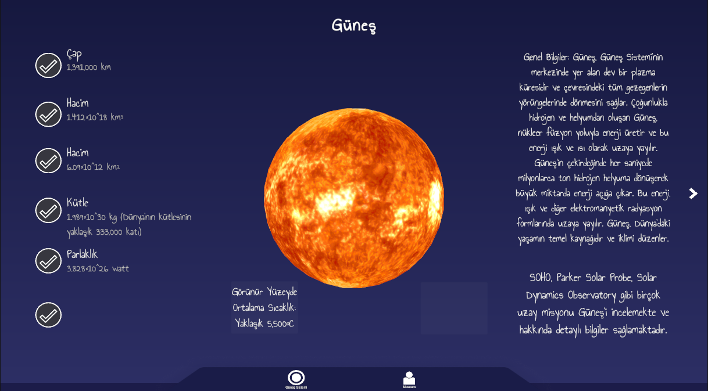
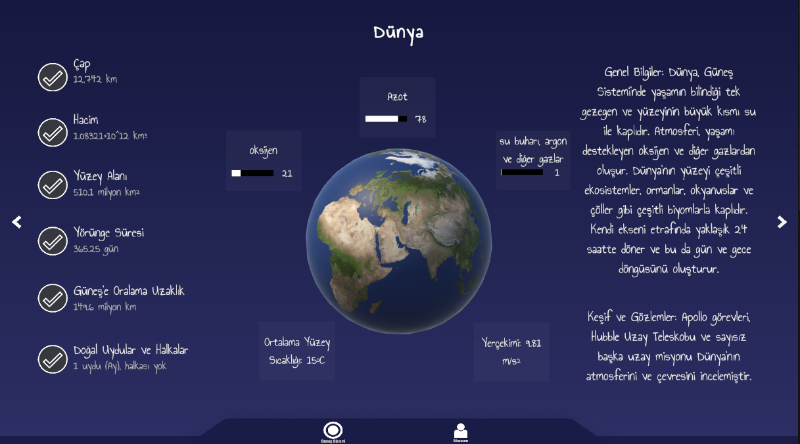

# 🌌 Solar System

An interactive **Solar System visualization and educational application** developed with **Unity and C#**.

This project was created during my internship in **August 2024** as an interactive application for exploring the Solar System, viewing planets, observing orbital motion, and displaying educational information about celestial objects.

The project was originally developed using Unity 2022.3.31f1.

Current project editor version: Unity 2022.3.62f3.

---

## 🪐 About the Project

Solar System provides an interactive visualization of the Sun and the eight planets of the Solar System.

Users can navigate between celestial objects and view information such as:

* Diameter
* Volume
* Surface area
* Orbital period
* Distance from the Sun
* Natural satellites and rings
* Surface temperature
* Gravity
* Atmospheric composition
* General information
* Exploration and observation information

The application also includes an animated Solar System view where planets move along their orbital paths.

---

## ✨ Features

* ☀️ Interactive Sun and planet visualization
* 🪐 Eight Solar System planets
* 🔄 Planet rotation
* 🌌 Orbital movement simulation
* 🛰️ Dynamically rendered orbital paths
* ⬅️ ➡️ Navigation between planets
* 🖱️ Mouse/drag-based planet navigation
* 🔍 Dynamic camera positioning and zoom
* 📊 Planet-specific information panels
* 🌍 Atmospheric composition visualization
* 📖 Educational descriptions for celestial objects
* 🖥️ Multiple UI views
* 💤 Inactivity / splash screen system

---

## 📸 Screenshots

### Solar System Overview



### Sun Information



### Earth Information



---

## 🛠️ Technologies

* **Unity 2022.3.62f3**
* **C#**
* Unity UI
* TextMeshPro
* LineRenderer
* Coroutines
* Unity Camera System

---

## ⚙️ Main Systems

### Orbital Motion

Each celestial object contains orbital and rotational properties.
Planet positions are calculated during runtime and updated continuously to simulate movement around the Sun.

### Orbit Rendering

Orbital paths are generated dynamically using Unity's `LineRenderer`.

### Planet Navigation

Users can move between planets using navigation controls or mouse dragging.

The camera automatically adjusts its position and orthographic size depending on the selected celestial object.

### Planet Information System

Each planet contains its own:

* Name
* Description
* Scientific information
* Numerical properties
* Atmospheric data
* Exploration information

The UI is updated dynamically when the selected planet changes.

### UI Management

The application contains different interface states for:

* Solar System overview
* Planet view
* Detailed information view
* Splash / inactivity screen

---

## 📂 Project Structure

```text
Solar-System/
│
├── Assets/
│   ├── Scripts/
│   ├── Scenes/
│   ├── Materials/
│   ├── Textures/
│   └── ...
│
├── Packages/
├── ProjectSettings/
├── Screenshots/
├── .gitignore
└── README.md
```

---

## 🚀 Running the Project

1. Clone the repository:

```bash
git clone https://github.com/JustBesa/Solar-System.git
```

2. Open **Unity Hub**.

3. Select **Add project from disk**.

4. Select the cloned `Solar-System` folder.

5. Open the project using:

```text
Unity 2022.3.62f3
```

6. Open the main scene from the `Assets` folder and press **Play**.

---

## ⚠️ Note

This project was developed primarily as an **interactive educational and visualization application**.

Planet sizes, orbital distances, orbital periods, and movement speeds may be adjusted for visualization purposes and should not be interpreted as a scientifically scaled astronomical simulation.

---

## 📅 Project Information

**Development Date:** August 2024
**Project Type:** Internship Project
**Engine:** Unity
**Programming Language:** C#

---

## 👩‍💻 Developer

Developed by **JustBesa**

GitHub: **@JustBesa**

---

## 📄 License

This project is published for portfolio and educational viewing purposes.

Unless otherwise stated, no permission is granted to copy, modify, redistribute, or commercially use the project content.
